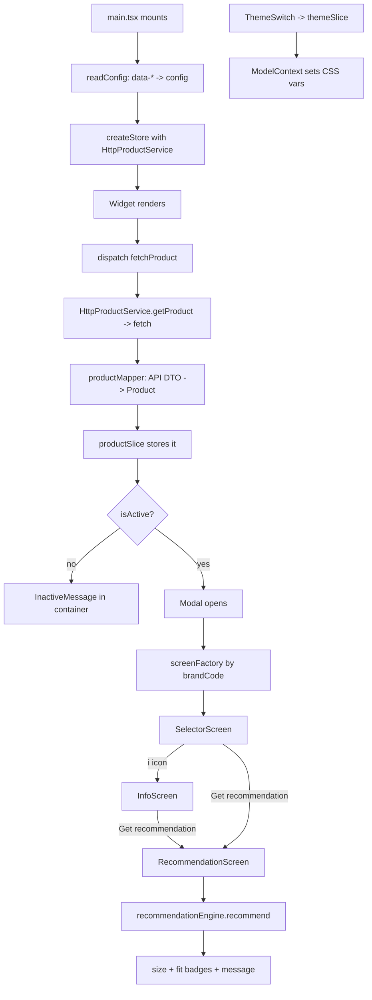

# SAIZ size recommender widget

An embeddable widget for a product page. It drops into a container, reads the
product details from the container's `data-*` attributes, calls the SAIZ API,
and — if the product is active — opens a modal with the screens below:

1. **Selector** – the shopper picks units (cm/in), gender, age, weight, height.
2. **Recommendation** – shows the recommended size, a fit message, the body
   figure with chest/waist fit badges, and the shop CTA.
3. **How it works** – an info screen reached from the `i` icon on the selector,
   explaining what the inputs are used for.

If the product is not active (or the call fails) it shows a small message inside
the container instead of opening the modal.

Stack: React 18 + TypeScript + Redux Toolkit + Vite. It builds to one
self-mounting JS file with its own scoped styles, so a host page needs a single
`<script>` tag.

---

## Running it

```bash
npm install
npm run dev        # http://localhost:5173
npm run build      # outputs dist/saiz-widget.js
npm run typecheck
```

The widget calls the real API only — there is no mock data. Copy `.env.example`
to `.env.local` and add the key before running:

```
VITE_SAIZ_API_KEY=your-key
VITE_SAIZ_BASE_URL=          # leave empty in dev to use the proxy and avoid CORS
```

It calls `GET {baseUrl}/api/Product/GetProductForWidget/{brandCode}/{productCode}`
with a `SAIZ-API-KEY` header. In dev, leaving the base URL empty routes requests
through the Vite proxy in `vite.config.ts` so the browser doesn't hit CORS. If
the call fails or returns an inactive product, the widget shows the inline
"unavailable" message instead of the modal.

Embedding on a page:

```html
<div id="saiz-widget-container"
     data-brandcode="ohapril"
     data-productcode="zahara-lace-longsleeve-black"
     data-visitorid="..."
     data-language="en-us"></div>
<script src="saiz-widget.js"></script>
```

---

## Folder structure

```
src/
  bootstrap/    reads the container's data-* attributes into a config object
  data/         talks to the API
    dto/          the raw API response shape
    services/     HttpProductService: fetches + delegates mapping
    mappers/      productMapper: API response -> our Product model
  domain/       app logic, independent of React and the API
    models/       Product, Measurements, Recommendation (plain types)
    ports/        ProductService interface (the contract the service implements)
    services/     recommendationEngine: picks the size from the measurements
  store/        Redux Toolkit
    slices/       product, navigation (current screen), measurements, theme
  theme/        ModelContext + brand palettes -> CSS variables
  brands/       factory that returns the screen set for a brand
    default/      SelectorScreen + InfoScreen + RecommendationScreen
  ui/           Modal, Widget, shared components, styles.css
  main.tsx      entry: find container, read config, build store, render
```

---

## How it flows



Same thing in plain words:

```
main.tsx
  -> readConfig()            read data-* attributes into a config object
  -> createStore()           inject HttpProductService
  -> <Widget>
       -> fetchProduct()     thunk calls HttpProductService.getProduct()
            -> fetch the API, then productMapper turns the response into Product
       -> productSlice        status = active | inactive | error
       -> not active -> <InactiveMessage>
       -> active     -> <Modal>
            -> screenFactory(brandCode) -> { Selector, Info, Recommendation }
            -> <SelectorScreen>          reads + updates the measurements slice
                 -> i icon            -> <InfoScreen> ("How it works")
                 -> Get recommendation -> <RecommendationScreen>
                      -> recommendationEngine.recommend(measurements, product)
                      -> size, message, chest/waist fit badges

Theme (separate, always available):
  ThemeSwitch -> themeSlice.toggleMode
             -> ModelContext resolves the brand palette for the mode
             -> writes --saiz-* CSS variables on the widget root
```

Navigation lives in `navigationSlice`. `selector` and `recommendation` are the
linear flow (the progress bar reads 50% then 100%); `info` is a branch reached
from the selector's `i` icon and returns to it with the back arrow.

---

## The patterns (what to point at in a review)

- **Clean layers.** `data` (API), `domain` (logic + models), `store` (state),
  `ui` (screens/components). Each layer only depends on the one below it, so a
  change in one place doesn't ripple everywhere.
- **Factory for screens** – `brands/screenFactory.ts` takes a `brandCode` and
  returns that brand's screen set (`registry.ts`), falling back to the default.
  A new brand registers its own screens without touching the modal.
- **Service class for the API** – `HttpProductService` fetches the product and
  hands the response to the mapper. It implements the `ProductService` interface
  so the rest of the app depends on the contract, not the fetch details.
- **Mapper** – `productMapper.ts` is the only place that knows the raw API
  shape. It converts the response into our own `Product`, so if the API changes,
  only the mapper changes.
- **Redux slices** – `product` (the loaded product), `navigation` (which screen
  is showing), `measurements` (the shopper's input), `theme` (light/dark).
- **ModelContext for theming** – holds the brand + mode, resolves a palette, and
  exposes it as CSS variables. Components only use `var(--saiz-*)`, so theme and
  brand colour changes happen in one file.

---

## Making changes quickly

| You want to… | Edit |
| --- | --- |
| Change colours, font, or radius | `src/theme/themes.ts` |
| Add a brand with its own colours | add an entry to `BRAND_THEMES` in `themes.ts` |
| Add a brand with its own screens | add screens + register them in `brands/registry.ts` |
| Change the size logic | `src/domain/services/recommendationEngine.ts` |
| Change how the API maps to our model | `src/data/mappers/productMapper.ts` |
| Change selector fields/labels | `src/brands/default/SelectorScreen.tsx` |
| Change the "How it works" copy | `src/brands/default/InfoScreen.tsx` |
| Change the recommendation layout | `src/brands/default/RecommendationScreen.tsx` |
| Change spacing / pixel details | `src/ui/styles.css` (everything is prefixed `.saiz-`) |
| Add a stored value | a slice in `src/store/slices/` |

All UI text and the screens live under `src/brands/default/`, so that's the
first place to look for "change this on the screen" requests.
